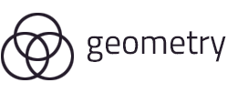

Geometry is Sphere's component library and design system

## Getting started

```
yarn|npm install @spherehq/geometry
```

Geometry comprises of the following sub packages:

| Package Name | Purpose                                   |
| ------------ | ----------------------------------------- |
| Components   | Base Components                           |
| System       | Design system utils and grid layout       |
| Theme        | Colour system, typography and breakpoints |

## Contributing

Thanks for your interest in contributing! Read up on our guidelines for contributing and then look through our issues with a `help wanted` and `package:geometry` label.
